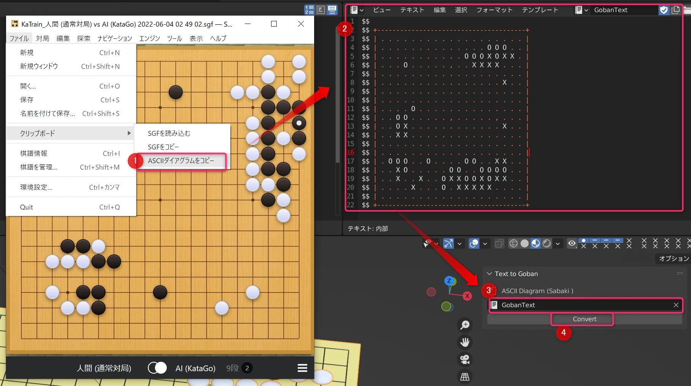

# Goban Generator Document

Goban Generator（碁盤ジェネレーター）は簡単に碁盤や局面のCGを作成し、漫画の作画や、映像、アート、出版物等、あなたの囲碁作品の創作を支援します。

ツールの提供を通じて囲碁を盛り上げ、ひいては囲碁の普及に一役買えたら幸いです。
https://www.youtube.com/watch?v=3ZP1XjDqpF0

# Store

- [Booth(Full)](https://kanitabe.booth.pm/items/4056324)
- [Booth(Limited)](https://kanitabe.booth.pm/items/4056686)
- [BlenderMarket](https://blendermarket.com/products/goban-generator)

# Documentation

## Required（要件）

- Blender 3.2.0~
- Sabaki（SGF Editor）

## Parameters（パラメーター）

GameRandomGenerateランダム生成を使用するかどうか。局面の妥当性は保証されません。

Whether random generation is used or not. The validity of the station is not guaranteed.SelectDistributionSeed碁石をランダムに選択するランダム式のシードStoneRandomRotation碁石をランダムに回転させるかどうかRotationSeed碁石のランダム回転のシード

## Stone Custmaize（碁石のカスタマイズ）

|  |  |
| :--- | :--- |

1.  大きさを碁盤に合うように調整し、Ctrl+Aでスケールやトランスフォームを適用してください。碁盤に接地する部分に原点を設定してください。
2.  **Black/White Stone Variations**コレクションの中に移動させてください。
3.  コレクションに格納された複数の中からランダムで選ばれます。

1.  Adjust the size to fit the board and use Ctrl+A to apply scale or transform. Set the origin at the part of the board where it will be grounded.
2.  Move it into the **Black/White Stone Variations** collection.
3.  It is randomly selected from several stored in the collection.

## Set Game Situation（局面の設定）

まず最初にasciigobantovertex.zipアドオンをインストールしてください。

1.  Sabakiから任意の盤面のASCIIダイアグラムをコピーします
2.  テキストビューを表示し任意のテキストファイルに貼り付けてください
3.  TextToGobanパネルからASCIIダイアグラムのあるテキストファイルを選択します
4.  Convertボタンを押してください。この際GamePointsコレクションおよびその中身は必ず表示状態にある必要があります。

First of all, install the asciigobantovertex.zip add-on.

1.  Copy the ASCII diagram of any board from Sabaki
2.  Display the Text View and paste it into any text file
3.  Select a text file with ASCII diagrams from the TextToGoban panel
4.  Press the Convert button. The GamePoints collection and its contents must be visible.

## Export（エクスポート）

実体化して別のソフトで扱う場合はモディファイアを適用してください。

If you want to materialize it and handle it with different software, apply the modifier.

## Recommended Shaders（オススメシェーダー）

シェーダーを上手く活用すれば作画時の手間をさらに省けるかもしれません。

If you make good use of shaders, you may be able to save even more time and effort when drawing.

> [Blender 使用、プロシージャルなハッチング＆漫画シェーダーの設定（データダウンロード/ ※英語ムービー）](https://3dtotal.jp/tutorials/26458/)

[https://3dtotal.jp/tutorials/26458/embed/#?secret=lA2pUpKsC5](https://3dtotal.jp/tutorials/26458/embed/#?secret=lA2pUpKsC5)
